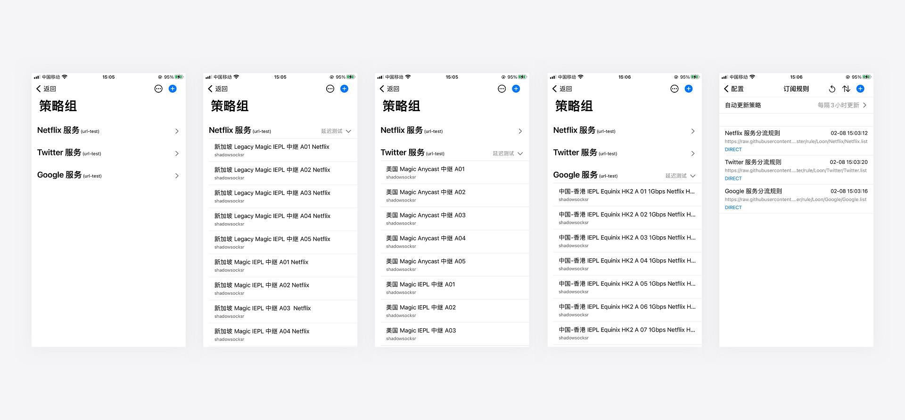
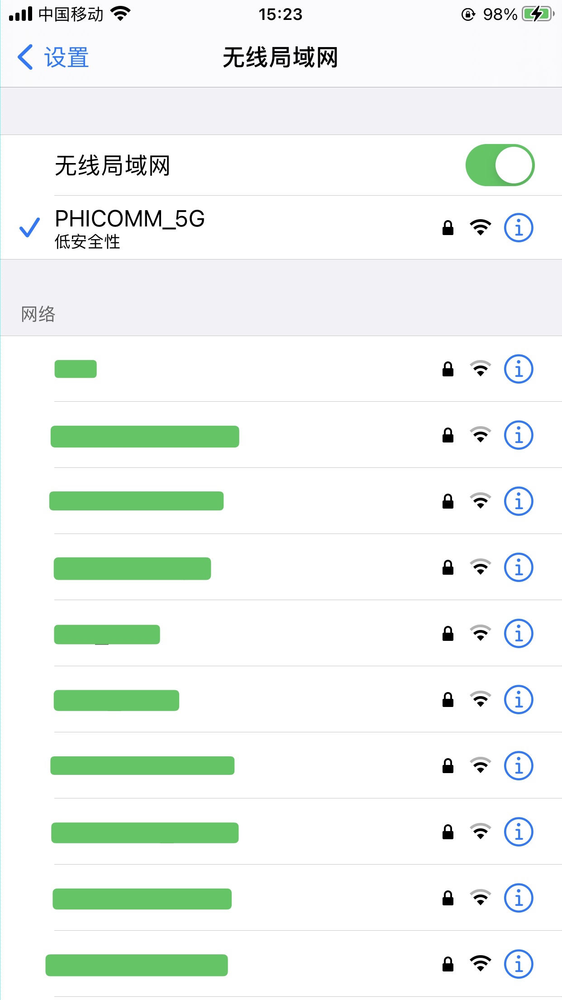
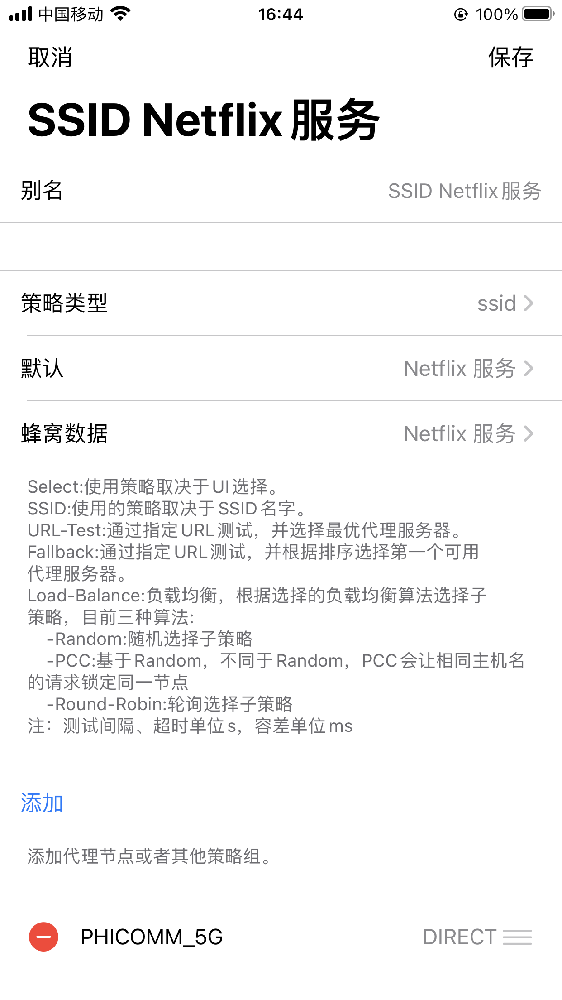
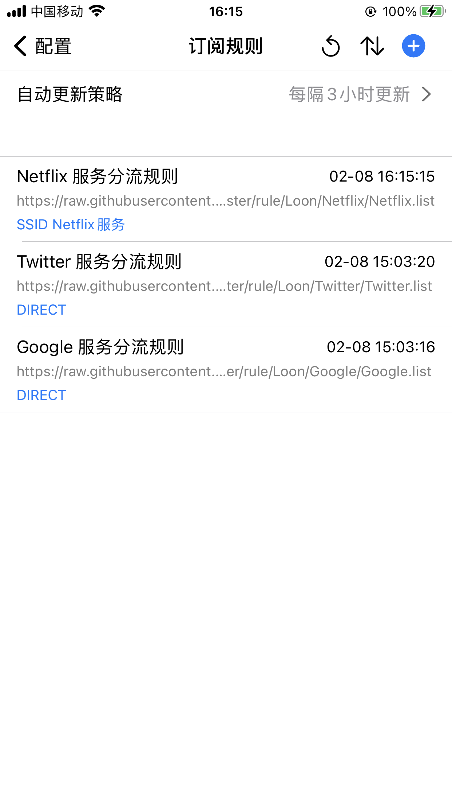
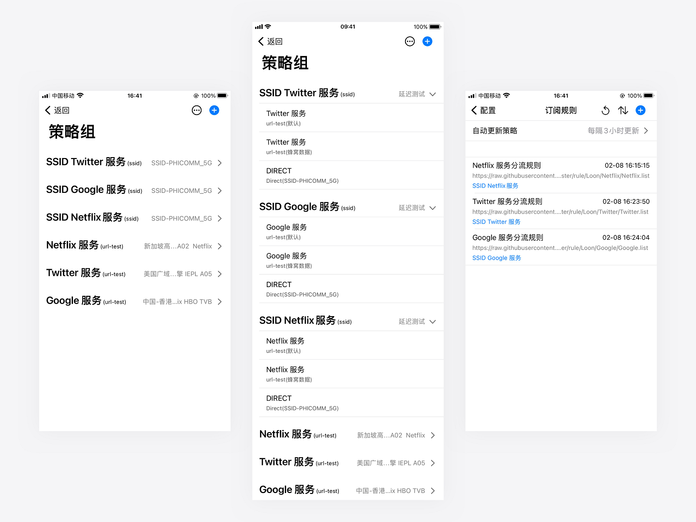
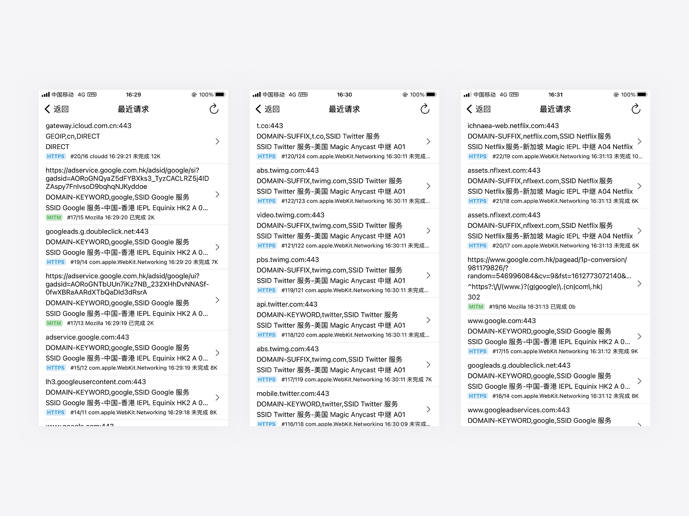
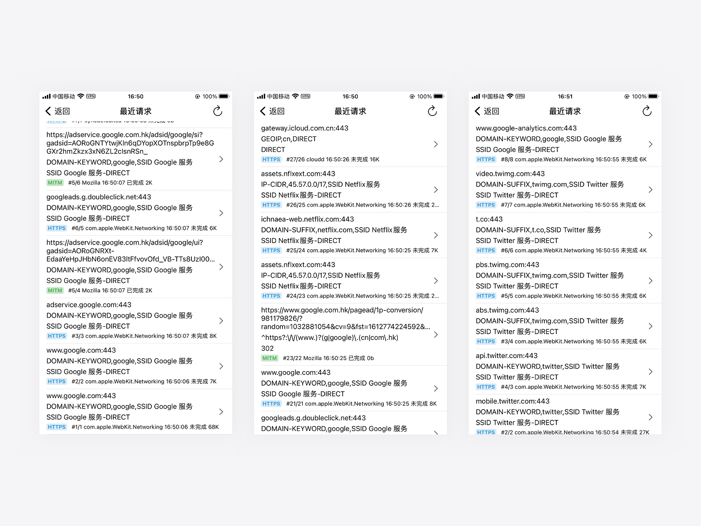

# Loon 的 SSID 策略组嵌套教程

**⚠本教程部分尺寸图片过大，建议打开图片以查看大图，左右滑动即可查看全部图片内容。**

**在开始这个教程之前，我们先抛出一个问题。**
> 1. 你家里已经提前做好了路由器的翻墙和策略分流，可以让不同的服务走不同地区的节点，如 `Twitter 服务` 走美国节点，`Netflix 服务` 走新加坡节点，`Google 服务` 走香港节点等；
> 2. 你需要在使用手机蜂窝网络（4G/5G）、公共 Wi-Fi 、朋友家的 Wi-Fi 和随身 Wi-Fi 时自动翻墙，而在使用家里路由器提供的 Wi-Fi 时自动走直连，且需要保持上述服务依然各自走不同地区的节点。

想要实现这样的策略分流，在 Loon 下我们该如何实现呢？

**[图一](images/1.png)是我们本次教程需要用到的策略组和分流规则，也是本次教程的前提。**

**`你需要提前设置好那些需要走不同地区节点的策略组和分流规则。`**

**教程的全部内容均以[图一](images/1.png)为基础做示范。你可以可活学活用，不必完全照搬。**

**[图一](images/1.png)里策略组和分流规则的创建方法在此不在赘述，你可以翻阅来自[chiupam  的教程](https://github.com/chiupam/tutorial/blob/master/Loon/Plus/README.md)来学习。**

图一

***

**为了解决我们前面遇到的问题，我们需要针对走不同地区节点的服务创建属于它们自身的 SSID 策略组，并且设置好 SSID 策略所需要嵌套的其他策略，这是解决这个问题的主要思路。**

**就拿 `Netflix 服务` 举例来说，它其实就是[图一](images/1.png)策略组中的 `Netflix 服务`，那么我们就先来解决 `Netflix 服务` 吧，具体步骤如下：**

**1. 参照[图二](images/2.png)查看路由器 Wi-Fi 名称；**
> * 我们需要先查看一下家里已经翻墙的路由器 Wi-Fi 名称叫什么，并记录下来，后面的步骤会需要你填写进去;
> * 比如我的手机当前连接的家里路由器 Wi-Fi 名称是 `PHICOMM_5G`，这台路由器已经做好了翻墙和策略分流，它可以让不同的服务走不同地区的节点；
> * 我们先记住这个 Wi-Fi 的名称，以备后用。

图二

**2. 参照[图三](images/3.png)创建一个策略类型为 `ssid` 的策略组；**
> * 参考[图一](images/1.png)中的已经提前做好的策略组例子，我们将这个使用 `ssid` 策略新建的策略组命名为 `SSID Netflix 服务`。这个策略组就是用来专门解决本教程提出的问题的**⚠ 这个策略组的名字和我们教程开始前提前做好的名字是完全不同的；**
> * 然后分别给 `默认` 和 `蜂窝数据` 分配[图一](images/1.png)中已经提前做好的 `Netflix 服务` 策略组；
> * 只有这样设置才会让 `Netflix 服务` 在使用手机蜂窝网络（4G/5G）、公共 Wi-Fi 、朋友家的 Wi-Fi 和随身 Wi-Fi 时自动翻墙；
> * 点击 `添加` 按钮，把前面刚刚记下的家里已经翻墙的路由器 Wi-Fi 名称填写进去，比如我的是 `PHICOMM_5G`，并给它分配 `DIRECT` 直连策略；
> * 经过这样的设置之后，当你连接家里已经翻墙的路由器的时候，才不会让你在使用 `Netflix 服务` 的时候再从 Loon 走二次翻墙。

图三

**3. 参考[图四](images/4.png)给 `Netflix 服务` 的分流规则分配刚刚新建好的 `SSID Netflix 服务` 策略组；**

图四

**4. 在经过前面四个步骤操作之后，就可以完美解决前面的问题了；**

**5. 还想创建更多类似的策略组？**

> * 如果还想做其他服务的 `ssid` 策略组，你可以直接参考 1~4 的步骤再做多个新的 `ssid` 策略组即可；
> * 千万别忘了给对应服务的分流规则分配你新建的 `ssid` 策略组，否则可能会出现二次翻墙的问题；
> * 毕竟你没给它指定 `ssid` 策略组。

**6. ⚠ 在做完上述设置之后，你需要返回 Loon 的仪表盘，进入 `兜底规则` 勾选使用新加坡节点的 `SSID Netflix 服务`并启动 Loon，这样才算是真正把这套配置用起来了，[如图五](images/5.png)勾选。**
> * 当然你也可以选择使用其他地区的策略组或者新建一个专门的兜底策略组分配使用，这个看个人喜好；
> * `兜底规则` 的意思是所有不在分流规则里的 IP 和域名，全部经由 `兜底规则` 处理；
> * `兜底规则` 里勾选的策略组代表 `所有不在分流规则里的 IP 和域名` 均使用该策略组。

图五

***

**基于上面的教程，来看看我们的配置成果吧，仅做参考：**

* [图六](images/6.png)是按照本教程做好的策略组和分流规则；

图六

* [图七](images/7.png)是在手机蜂窝数据下使用上面的策略组让 `Twitter 服务` 走美国节点，`Netflix 服务` 走新加坡节点，`Google 服务` 走香港节点的具体流量走向；
> [图七](images/7.png)表明明 `Twitter 服务`、`Netflix 服务` 和 `Google 服务` 此时分别走了 `美国`、`新加坡` 和 `香港` 的节点。

图七

* [图八](images/8.png)是在手机连接家里的路由器 Wi-Fi 时 `Twitter 服务` 走美国节点，`Netflix 服务` 走新加坡节点，`Google 服务` 走香港节点的具体流量走向。

> * ⚠ 图中所连接的路由器 Wi-Fi 正是我们本次教程中提到的已经做好了翻墙和策略分流的路由器，它本身就已经它可以让不同的服务走不同地区的节点了，所以当然是要 Loon 自动直连了；
> * [图八](images/8.png)表明 `Twitter 服务`、`Netflix 服务`和`Google 服务`此时全部走了 `DIRECT` 直连。 

图八

***

**至此，我们已经将教程前面所提到的问题完美解决了。**

**教程中的例子切勿生搬硬套，建议理解其中原理，再动手操作。**